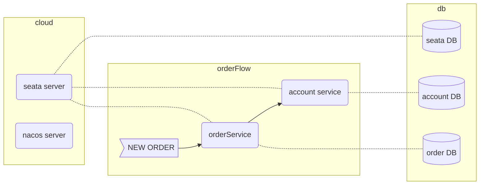

# seata-test

*   [概述](#概述)
*   [實驗方式](#seata-at模式實驗方式)
*   [實驗結果](#seata-at模式實驗結果)
    *   [global transaction](#僅使用global-transaction)
        *   [global transaction + unbind](#使用global-transaction並在程式碼中加入rootcontextunbind)
    *   [local transaction](#僅開啟local-transaction)
    *   [global + local transaction](#使用local-transaction--global-transaction)
        *   [global + local transaction + unbind](#使用global--local-transaction並在程式碼中加入rootcontextunbind)
    *   [global lock](#只使用global-lock)
    *   [結論](#結論)
    *   [建議](#建議)
*   [How to start](#how-to-start)
*   [how to build docker compose](#how-to-build-docker-compose)

## 概述

這是一個用來測試seata AT模式如何對全局事務進行操作處理的實驗，幫助了解在什麼場景下，應該如何應用seata


## Seata AT模式實驗方式

為了清楚理解全局事務的各種情況，開發了以下架構之微服務系統，透過下單的流程了解seata的行為


## seata AT模式實驗結果

### 僅使用global transaction

1. #### 單純開global transaction
> 1. 一開始不會開local transaction
> 2. 會在開啟時直接新增xid
> 3. 如果跑到一半掛掉，xid和行鎖都會留在seata上，直到timeout後會解鎖，seata會等service開好以後，叫service把那行rollback

2. #### 開global transaction使用一般select
> 1. 不會上鎖，不會檢查鎖
> 2. 假如查的行已經被上鎖，也查得到

3. #### 開global transaction來save
> 1. 會在save時直接加入全局行鎖
> 2. 不會在該行加上本地行鎖
> 3. 其他thread都能讀到這個save的結果(dirty read)

4. #### 開global transaction來update by uid
> 1. 會在update by uid時加入全局行鎖，鎖定該pid
> 2. 不會在該行加上本地行鎖
> 3. 其他thread都能讀到這個update的結果(dirty read)
> 4. 假如要更新的row已被上鎖，會重試幾次無法拿到鎖，就timeout，回傳失敗

5. #### 開global transaction來一般update
> 1. 會在update時在全局行鎖加上所有剛剛update的row的pid
> 2. 不會在該行加上本地行鎖
> 3. 其他thread都能讀到這個update的結果(dirty read)
> 4. 假如要更新的row已被上鎖，會重試幾次無法拿到鎖，就timeout，回傳失敗

6. #### 開global transaction來select for update
> 1. 不會加上全局行鎖，不過會檢查全局鎖
> 2. 會去seata檢查全局鎖，假如拿不到的話，會重複試到timeout就回傳失敗

7. #### 開global lock來select for update
> 1. 不會加上全局行鎖，不過會檢查全局鎖
> 2. 會去seata檢查全局鎖，假如拿不到的話，會重複試到timeout就回傳失敗

8. #### 將global transaction打開後放到timout
> 1. 假如service還活著，會先rollback該全局事務
> 2. 如果後來request有跑完，也會因為該事務已經超時，再做一次rollback，但應該不會影響資料
> 3. rollback時會報的錯是`client detected transaction timeout before commit, so change to rollback`

9. #### 將global transaction打開後中途從外部修改資料
> 1. 如果程式後來有繼續跑完，還是會正常commit，無視外部資料修改
> 2. 如果程式掛掉或超時，seata會開始做rollback，但是會產生rollback fail，並且造成：
     >    1. ==lock和transaction會保留在seata server上，該行被永遠lock住==
>    2. ==seata server會一直嘗試rollback這個transaction，每隔１０秒試一次，直到超時==
>    3. ==global table裡面該條事務的狀態會是６（全局事务超时回滚中），等到超時以後會變成１４（二阶段超时回滚失败）==
>    4. ==branch table裡面的狀態會是0(unknown)==

10. #### 下游service開啟global transaction但是上游不加上@GlobalTransaction
> 1. 上游service的行為與有加global transaction相同
> 2. 看起來應該無法關閉seata的追蹤
> 3. 猜測如果要關閉seata對上游的追蹤，必須使用沒有seata的service，或是用不同的data proxy

11. #### 上游service開啟global transaction但是下游不加上@GlobalTransaction
> 1. 上游會將自己視為獨立的global transaction，上游執行完以後就直接commit並且結束global transaction
> 2. 下游收到上游的回傳以後，即使rollback也與上游無關，因為上游已經commit結束了

<br>
<br>

#### 使用global transaction，並在程式碼中加入==RootContext.unbind()==
- 待補完


<br>
<br>
<br>
<br>

### 僅開啟local transaction

1. #### 開啟transaction後中途修改資料
> 1. 仍會commit，但中途修改的資料在commit後不會又覆蓋過去
     >     1. 原本訂單金額為50
>     2. 開啟transaction，將訂單金額改為80
>     3. 從外部查看資料，因為事務隔離性，金額仍為50
>     2. 在外部手動更改訂單金額為100
>     3. transaction結束，commit修改
>     4. 此時transaction會成功，但是訂單金額仍然是被中途修改的100


<br>
<br>
<br>
<br>


### 使用local transaction + global transaction

1. #### 開transaction基本行為
> 1. 會在開啟時global table直接新增xid
> 2. 在新增資料時，不會加入lock在lock table
> 3. 在整個transaction commit的時候，才會把增刪改row放進lock table中

2. #### 開transaction並執行select for update
> 1. local transaction會保持該行的鎖，直到commit時才會釋放該行的鎖

3. #### 開transaction後，執行完之前rollback
> 1. 完全執行完的上游service，才會真的把資料commit進db，並且在undo log留rollback info
> 2. rollback時，最下游的service因為還沒commit，所以沒有commit資料進db，也不用去rollback
> 3. 實際會rollback的service只有上游已經完全跑完並且commit的service

4. #### 開transaction後，還沒commit這個row時，中途用另一個transaction查詢同一row，並使用select for update(以上兩個transaction皆是local+global)
> 1. 第二個進來的transaction會在select for update時等到超時，這個行為跟單純開啟local transaction做select for update被行鎖lock住時是相同的

5. #### 開transaction後，commit掉上游的service，還沒commit下游service時，中途用另一個只有開local transaction的request近來對同一個row做select for update並update
> 1. 由於上游的service已經commit掉，所以這個row資料已經更改，local lock也已經解開
> 2. 由於下游的service還沒commit，所以global lock還在
> 3. 中途進來的request因為只有開local request，所以不會去檢查global lock，可以直接透過select for update查詢到該資料被剛更改後的狀態，並且update後commit成功
> 4. 此時如果下游service要commit的話可以直接commit成功，但是上游service的資料會保持被中途插入的service複寫的結果
> 5. 此時如果下游service要rollback的話，則會因為上游service的資料已經被中途插入的service更改了，與undo log內的資料不符，導致上游rollback失敗，把這個row給永遠鎖住

6. #### 開transaction後，commit掉上游的service，還沒commit下游service時，中途用另一個只有開global lock的request近來對同一個row做select for update
> 1. 第二個進來的transaction會在select for update時不停對seata要求取得global lock，由於拿不到這個row的lock，最後在重試到超時以後回傳失敗
> 2. 失敗exception為：`io.seata.rm.datasource.exec.LockWaitTimeoutException: Global lock wait timeout`

7. #### 開transaction後，還沒commit這個row時，中途用另一個只有開global lock的request查詢同一row，並使用select lock in share mode
> 1. 第二個進來的transaction在select lock in share mode時，還是會順利拿到資料，不會被local或global的lock鎖住
> 2. 沒有被local的lock鎖住，是因為中途進來的request只有開global lock，沒有開local transaction，所以沒有觸發lock in share mode的檢查鎖的功能
> 3. 沒有被global的lock鎖住，是因為seata不支援lock in share mode，因為seata中沒有讀鎖的功能
> 4. 也就是，seata下不能夠同時開啟local和global的讀鎖，只能夠開啟local寫鎖，而select for update只能偵測寫完了沒，但不能有讀鎖的功能，這會造成同時可能有兩個thread對某個row一起更新，並在其中一條commit以後，另一條thread增刪改時發生失敗才整個回滾。

8. #### local + global transaction解鎖上鎖時間差問題：
> 1. 上游service在commit瞬間，會先提交local資料並解開local鎖，再去seata上global鎖，這兩個動作中間是否有時間差造成有空隙可以被別的transaction讀取？
> 2. 經過檢查db log發現，seata會先將seata db上全局鎖以後，再回頭把service的local transaction commit掉，因此不會有解鎖到上鎖之間的間隙
     - 解鎖到加鎖之間的db log
     
     

9. #### 開啟transaction後中途修改資料
> 1. 仍會commit，但中途修改的資料在commit後不會又覆蓋過去
     > 		1. 原本訂單金額為50
     > 		2. 開啟transaction，將訂單金額改為80
     > 		3. 從外部查看資料，因為事務隔離性，金額仍為50
     > 		2. 在外部手動更改訂單金額為100
     > 		3. transaction結束，commit修改
     > 		4. 此時transaction會成功，但是訂單金額仍然是被中途修改的100

10. #### 執行完上游service並commit上游後，再次進入同一個上游service，select for update之後卡住直到超時
> 1. 本來global transaction超時就會直接rollback，但因為上游service仍然拿著更改的row的local lock，而seata在做rollback時也會拿取local lock，因此seata會因為拿不到local lock造成rollback失敗
> 2. 要等到上游service關閉並釋放鎖以後，rollback才會成功。
> 3. 目前不確定seata會重試rollback重試多久，放了一個週末都還在rollback，應該是會無止禁的重試下去

<br>
<br>

#### 使用global + local transaction，並在程式碼中加入==RootContext.unbind()==
1. ##### 基本行為
> 1. 一開始還是會在request開始時建立xid在global table中
> 2. 會==關閉該request的global transaction==行為
> 3. 該service的行為不會被記錄到undo log和seata中
> 4. 如果transaction結束之後，xid有殘留在global table中，等到超時以後xid會自動從global table中清掉

2. ##### 下游正常開啟global transaction，而上游service在request中執行RootContext.unbind()
> 1. 此時如果下游執行rollback，有使用RootContext.unbind()的上游service不會被rollback
> 2. 下游的執行跟一般global transaction無異

3. ##### 下游開啟global transaction後，還沒做任何事之前執行RootContext.unbind()
> 1. 後續行為都不會有transaction行為，但是還是會留著xid在global table上
> 2. 如果最後rollback，xid會殘留在global table中，等到超時以後xid會自動從global table中清掉
> 3. 如果最後commit，xid會自動從global table中清掉
> 4. 如果上游有開global transaction，則視為上游獨立的事物，與下游無關，在上游request執行完以後這個事務就會提交並且清空

4. ##### 下游開啟global transaction後，上游有正常將記錄行為到lock table和undo log裏，然後在下游執行RootContext.unbind()
> 1. 這時如果成功commit，上游還是會清掉所有lock和undo log，並且把xid從global table清掉
> 2. 這時如果rollback，上游還是會rollback掉所有相關的undo log和清掉lock table，但是不會把xid從global table清掉
> 3. 因為在commit之前就關閉了context，所以不會寫入任何undo log或lock，所以下游也不會在commit或rollback時做什麼事情。(這是因為同時開啟了local transaction，所以動作會在request最後一刻才commit)


<br>
<br>
<br>
<br>


### 只使用global lock

1. #### 開啟global lock並且使用select for update
> 1. 會在執行前檢查該row是否有在seata上鎖，沒上鎖才能讀，但是執行時不會在seata上讀鎖，因為seata沒有讀鎖的功能

2. #### 開啟global lock並且使用select lock in share mode
> 1. 不會有任何功能，seata不支援讀鎖


<br>
<br>
<br>
<br>

### 結論

> 1. 可以發現global和local transaction是可以一起使用的，並且同時使用也可以確保資料不會出現髒讀和複寫的狀況

> 2. 上游service雖然不用註解global transaction，也可以在下游service開啟global transaction以後，並呼叫上游時，自動開啟global transaction。但是這會導致當上游service自行執行的時候，不會開啟global transaction，而發生預期外的行為

> 3. global transaction的rollback會使用select for update，因此平常的操作就該使用select for update避免與global transaction衝突

> 4. 一般只使用local transaction，不使用global transaction的查詢，應該考慮可能讀到全局事務的髒寫資料

> 5. 一般只使用global transaction，不使用local transaction的查詢，應該考慮可能讀到local commit前的舊資料

> 6. 一班的查詢，應該考慮可能讀到髒寫資料和舊資料


### 建議

> 1. local和global transaction應同時使用，才能避免髒讀和複寫

> 2. 雖然下游只要有加上`@GlobalTransaction`，上游service被呼叫的接口就會自動使用全局事務，但是避免哪天被呼叫時剛好沒有加到`@GlobalTransaction`，會造成上游service連帶失去事務效果，因此每個上游的service，都還是必須加上`@GlobalTransaction`註解，保證會在執行時開啟transaction

> 3. transaction中讀取重要資料時，必須使用`select for update`，避免髒讀，或是讀到舊資料

> 4. 需要寫入資料時，都必須先用`select for update`排除其他transaction去讀這筆資料，以免造成其他同時進行的request讀到錯誤資料

> 5. `select lock in share mode`在seata中沒有效果，如果要避免讀取別人髒寫的資料，只能使用`global lock`(或`global transaction`) + `select for update`

> 6. 由於只要下游開啟global transaction，上游就會連帶被開啟global transaction。如果想要完全不用事務來做簡單的操作時，應該要用`RootContext.unbind()`來解開transaction，不過要注意`RootContext.unbind()`的一些side effect


<br>
<br>
<br>
<br>


## How to start

1. docker compose
run under `seata-server` folder
```shell
docker-compose up
```

<br>

2. login db and run script
`127.0.0.1:3310` `root` `123456`
```sql
CREATE DATABASE seata;
USE seata;

-- -------------------------------- The script used when storeMode is 'db' --------------------------------
-- the table to store GlobalSession data
CREATE TABLE IF NOT EXISTS `global_table`
(
    `xid`                       VARCHAR(128) NOT NULL,
    `transaction_id`            BIGINT,
    `status`                    TINYINT      NOT NULL,
    `application_id`            VARCHAR(32),
    `transaction_service_group` VARCHAR(32),
    `transaction_name`          VARCHAR(128),
    `timeout`                   INT,
    `begin_time`                BIGINT,
    `application_data`          VARCHAR(2000),
    `gmt_create`                DATETIME,
    `gmt_modified`              DATETIME,
    PRIMARY KEY (`xid`),
    KEY `idx_status_gmt_modified` (`status` , `gmt_modified`),
    KEY `idx_transaction_id` (`transaction_id`)
) ENGINE = InnoDB
  DEFAULT CHARSET = utf8mb4;

-- the table to store BranchSession data
CREATE TABLE IF NOT EXISTS `branch_table`
(
    `branch_id`         BIGINT       NOT NULL,
    `xid`               VARCHAR(128) NOT NULL,
    `transaction_id`    BIGINT,
    `resource_group_id` VARCHAR(32),
    `resource_id`       VARCHAR(256),
    `branch_type`       VARCHAR(8),
    `status`            TINYINT,
    `client_id`         VARCHAR(64),
    `application_data`  VARCHAR(2000),
    `gmt_create`        DATETIME(6),
    `gmt_modified`      DATETIME(6),
    PRIMARY KEY (`branch_id`),
    KEY `idx_xid` (`xid`)
) ENGINE = InnoDB
  DEFAULT CHARSET = utf8mb4;

-- the table to store lock data
CREATE TABLE IF NOT EXISTS `lock_table`
(
    `row_key`        VARCHAR(128) NOT NULL,
    `xid`            VARCHAR(128),
    `transaction_id` BIGINT,
    `branch_id`      BIGINT       NOT NULL,
    `resource_id`    VARCHAR(256),
    `table_name`     VARCHAR(32),
    `pk`             VARCHAR(36),
    `status`         TINYINT      NOT NULL DEFAULT '0' COMMENT '0:locked ,1:rollbacking',
    `gmt_create`     DATETIME,
    `gmt_modified`   DATETIME,
    PRIMARY KEY (`row_key`),
    KEY `idx_status` (`status`),
    KEY `idx_branch_id` (`branch_id`),
    KEY `idx_xid` (`xid`)
) ENGINE = InnoDB
  DEFAULT CHARSET = utf8mb4;

CREATE TABLE IF NOT EXISTS `distributed_lock`
(
    `lock_key`       CHAR(20) NOT NULL,
    `lock_value`     VARCHAR(20) NOT NULL,
    `expire`         BIGINT,
    primary key (`lock_key`)
) ENGINE = InnoDB
  DEFAULT CHARSET = utf8mb4;

INSERT INTO `distributed_lock` (lock_key, lock_value, expire) VALUES ('AsyncCommitting', ' ', 0);
INSERT INTO `distributed_lock` (lock_key, lock_value, expire) VALUES ('RetryCommitting', ' ', 0);
INSERT INTO `distributed_lock` (lock_key, lock_value, expire) VALUES ('RetryRollbacking', ' ', 0);
INSERT INTO `distributed_lock` (lock_key, lock_value, expire) VALUES ('TxTimeoutCheck', ' ', 0);

GRANT ALL PRIVILEGES ON *.* TO 'root'@'localhost' IDENTIFIED BY '123456' WITH GRANT OPTION;
```
(https://github.com/seata/seata/blob/develop/script/server/db/mysql.sql)

<br>

3. start account and order service


## how to build docker compose

### docker volume
https://blog.csdn.net/qq_31671187/article/details/127865221
```shell
docker run --name seata-server-test -p 8091:8091 -p 7091:7091 seataio/seata-server:1.7.0
docker cp seata-server-test:/seata-server ./config/docker-data/seata

docker run -p 3310:3306 --platform linux/x86_64/v8 --name mysql5.7-test -e MYSQL_ROOT_PASSWORD=123456 -d mysql:5.7 --character-set-server=utf8mb4 --collation-server=utf8mb4_unicode_ci
docker cp {mysql volume}

docker pull zhusaidong/nacos-server-m1:2.0.3
docker run --name nacos-standalone -e MODE=standalone -e JVM_XMS=512m -e JVM_XMX=512m -e JVM_XMN=256m -p 8848:8848 -d zhusaidong/nacos-server-m1:2.0.3
docker cp seata-server-nacos-1:/home/nacos/ ./
```

4. import postman

<br>
<br>
<br>
<br>


### seata config

#### server side 
- application.yml
```yaml
server:
  port: 7091

spring:
  application:
    name: seata-server

logging:
  config: classpath:logback-spring.xml
  file:
    path: ${user.home}/logs/seata
  extend:
    logstash-appender:
      destination: 127.0.0.1:4560
    kafka-appender:
      bootstrap-servers: 127.0.0.1:9092
      topic: logback_to_logstash
  level:
    io:
      seata: debug

console:
  user:
    username: seata
    password: seata

seata:
  config:
    # support: nacos, consul, apollo, zk, etcd3
    type: file

  registry:
    # support: nacos, eureka, redis, zk, consul, etcd3, sofa
    type: nacos
    file: 
      name: file.conf
    nacos:
      server-addr: nacos:8848
      application: "seata-server"
      group: "SEATA_GROUP"
      namespace: ""
      cluster: "default"


  store:
    # support: file 、 db 、 redis
    mode: db
    db:
      datasource: druid
      db-type: mysql
      driver-class-name: com.mysql.jdbc.Driver
      url: jdbc:mysql://db:3306/seata?useUnicode=true&characterEncoding=utf8&connectTimeout=1000&socketTimeout=3000&autoReconnect=true&useSSL=false
      user: root
      password: 123456
      min-conn: 10
      max-conn: 100
      global-table: global_table
      branch-table: branch_table
      lock-table: lock_table
      distributed-lock-table: distributed_lock
      query-limit: 1000
      max-wait: 5000

  transport:
    type: TCP
    server: NIO
    heartbeat: true
    enableClientBatchSendRequest: false
    threadFactory:
      bossThreadPrefix: NettyBoss
      workerThreadPrefix: NettyServerNIOWorker
      serverExecutorThreadPrefix: NettyServerBizHandler
      shareBossWorker: false
      clientSelectorThreadPrefix: NettyClientSelector
      clientSelectorThreadSize: 1
      clientWorkerThreadPrefix: NettyClientWorkerThread
      bossThreadSize: 1
      workerThreadSize: default
    shutdown:
      wait: 3
    serialization: seata
    compressor: none

  service:
    vgroupMapping:
      my_test_tx_group: default
    default:
      grouplist: seata:8091
    enableDegrade: false
    disableGlobalTransaction: false

  client:
    rm: 
      asyncCommitBufferLimit: 10000
      lock:
        retryInterval: 10
        retryTimes: 30
        retryPolicyBranchRollbackOnConflict: true
      reportRetryCount: 5
      tableMetaCheckEnable: false
      sqlParserType: druid
      reportSuccessEnable: false
      sagaBranchRegisterEnable: false
    tm:
      commitRetryCount: 5
      rollbackRetryCount: 5
      degradeCheck: false
      degradeCheckAllowTimes: 10
      degradeCheckPeriod: 2000
    undo:
      dataValidation: true
      logSerialization: jackson
      onlyCareUpdateColumns: true
      logTable: undo_log
    log:
      exceptionRate: 100

  server:
    recovery:
      committingRetryPeriod: 1000
      asynCommittingRetryPeriod: 1000
      rollbackingRetryPeriod: 1000
      timeoutRetryPeriod: 1000
    maxCommitRetryTimeout: -1
    maxRollbackRetryTimeout: -1
    rollbackRetryTimeoutUnlockEnable: false
    undo:
      logSaveDays: 7
      logDeletePeriod: 86400000

  metrics:
    enabled: false
    registryType: compact
    exporterList: prometheus
    exporterPrometheusPort: 9898

#  server:
#    service-port: 8091 #If not configured, the default is '${server.port} + 1000'
  security:
    secretKey: SeataSecretKey0c382ef121d778043159209298fd40bf3850a017
    tokenValidityInMilliseconds: 1800000
    ignore:
      urls: /,/**/*.css,/**/*.js,/**/*.html,/**/*.map,/**/*.svg,/**/*.png,/**/*.jpeg,/**/*.ico,/api/v1/auth/login
```

#### client side
- file.conf
```
#  Copyright 1999-2019 Seata.io Group.
#
#  Licensed under the Apache License, Version 2.0 (the "License");
#  you may not use this file except in compliance with the License.
#  You may obtain a copy of the License at
#
#  http://www.apache.org/licenses/LICENSE-2.0
#
#  Unless required by applicable law or agreed to in writing, software
#  distributed under the License is distributed on an "AS IS" BASIS,
#  WITHOUT WARRANTIES OR CONDITIONS OF ANY KIND, either express or implied.
#  See the License for the specific language governing permissions and
#  limitations under the License.

transport {
  # tcp, unix-domain-socket
  type = "TCP"
  #NIO, NATIVE
  server = "NIO"
  #enable heartbeat
  heartbeat = true
  # the tm client batch send request enable
  enableTmClientBatchSendRequest = false
  # the rm client batch send request enable
  enableRmClientBatchSendRequest = true
   # the rm client rpc request timeout
  rpcRmRequestTimeout = 2000
  # the tm client rpc request timeout
  rpcTmRequestTimeout = 30000
  # the rm client rpc request timeout
  rpcRmRequestTimeout = 15000
  #thread factory for netty
  threadFactory {
    bossThreadPrefix = "NettyBoss"
    workerThreadPrefix = "NettyServerNIOWorker"
    serverExecutorThread-prefix = "NettyServerBizHandler"
    shareBossWorker = false
    clientSelectorThreadPrefix = "NettyClientSelector"
    clientSelectorThreadSize = 1
    clientWorkerThreadPrefix = "NettyClientWorkerThread"
    # netty boss thread size
    bossThreadSize = 1
    #auto default pin or 8
    workerThreadSize = "default"
  }
  shutdown {
    # when destroy server, wait seconds
    wait = 3
  }
  serialization = "seata"
  compressor = "none"
}
service {
  #transaction service group mapping
  vgroupMapping.my_test_tx_group = "default"
  #only support when registry.type=file, please don't set multiple addresses
  default.grouplist = "127.0.0.1:8091"
  #degrade, current not support
  enableDegrade = false
  #disable seata
  disableGlobalTransaction = false
}

client {
  rm {
    asyncCommitBufferLimit = 10000
    lock {
      retryInterval = 10
      retryTimes = 30
      retryPolicyBranchRollbackOnConflict = true
    }
    reportRetryCount = 5
    tableMetaCheckEnable = false
    tableMetaCheckerInterval = 60000
    reportSuccessEnable = false
    sagaBranchRegisterEnable = false
    sagaJsonParser = "fastjson"
    sagaRetryPersistModeUpdate = false
    sagaCompensatePersistModeUpdate = false
    tccActionInterceptorOrder = -2147482648 #Ordered.HIGHEST_PRECEDENCE + 1000
    sqlParserType = "druid"
    branchExecutionTimeoutXA = 60000
    connectionTwoPhaseHoldTimeoutXA = 10000
  }
  tm {
    commitRetryCount = 5
    rollbackRetryCount = 5
    defaultGlobalTransactionTimeout = 60000
    degradeCheck = false
    degradeCheckPeriod = 2000
    degradeCheckAllowTimes = 10
    interceptorOrder = -2147482648 #Ordered.HIGHEST_PRECEDENCE + 1000
  }
  undo {
    dataValidation = true
    onlyCareUpdateColumns = true
    logSerialization = "jackson"
    logTable = "undo_log"
    compress {
      enable = true
      # allow zip, gzip, deflater, 7z, lz4, bzip2, zstd default is zip
      type = zip
      # if rollback info size > threshold, then will be compress
      # allow k m g t
      threshold = 64k
    }
  }
  loadBalance {
      type = "XID"
      virtualNodes = 10
  }
}
log {
  exceptionRate = 100
}
```

- registry.conf
```
#  Copyright 1999-2019 Seata.io Group.
#
#  Licensed under the Apache License, Version 2.0 (the "License");
#  you may not use this file except in compliance with the License.
#  You may obtain a copy of the License at
#
#  http://www.apache.org/licenses/LICENSE-2.0
#
#  Unless required by applicable law or agreed to in writing, software
#  distributed under the License is distributed on an "AS IS" BASIS,
#  WITHOUT WARRANTIES OR CONDITIONS OF ANY KIND, either express or implied.
#  See the License for the specific language governing permissions and
#  limitations under the License.

registry {
  # file 、nacos 、eureka、redis、zk、consul、etcd3、sofa、custom
  type = "nacos"

  nacos {
    application = "seata-server"
    serverAddr = "127.0.0.1:8848"
    group = "SEATA_GROUP"
    namespace = ""
    username = "nacos"
    password = "nacos"
    contextPath = ""
    ##if use MSE Nacos with auth, mutex with username/password attribute
    #accessKey = ""
    #secretKey = ""
    ##if use Nacos naming meta-data for SLB service registry, specify nacos address pattern rules here
    #slbPattern = ""
  }
}

config {
  # file、nacos 、apollo、zk、consul、etcd3、springCloudConfig、custom
  type = "file"

  file {
    name = "file.conf"
  }
  custom {
    name = ""
  }
}
```

### nacos config

#### server side
- application.properties (modify this part)
```
#Transaction storage configuration, only for the server. The file, db, and redis configuration values are optional.
store.mode=db
#Used for password encryption
#store.publicKey=

#These configurations are required if the `store mode` is `db`. If `store.mode,store.lock.mode,store.session.mode` are not equal to `db`, you can remove the configuration block.
store.db.datasource=druid
store.db.dbType=mysql
store.db.driverClassName=com.mysql.jdbc.Driver
store.db.url=jdbc:mysql://db:3306/seata?rewriteBatchedStatements=true&serverTimezone=Asia/Shanghai
store.db.user=root
store.db.password=123456
store.db.minConn=5
store.db.maxConn=30
store.db.globalTable=global_table
store.db.branchTable=branch_table
store.db.distributedLockTable=distributed_lock
store.db.queryLimit=100
store.db.lockTable=lock_table
store.db.maxWait=5000
```

### client side
- bootstrap.yml
```yaml
spring:
  application:
    name: account-service
  cloud:
    nacos:
      config:
        server-addr: 127.0.0.1:8848
        file-extension: yml
```

- application.yml
```yaml
spring:
  application:
    name: account-service

  cloud:
    nacos:
      config:
        enabled: true
        server-addr: 127.0.0.1:8848

      discovery:
        username: nacos
        password: nacos
        enabled: true
        server-addr: 127.0.0.1:8848
        register-enabled: true
```
